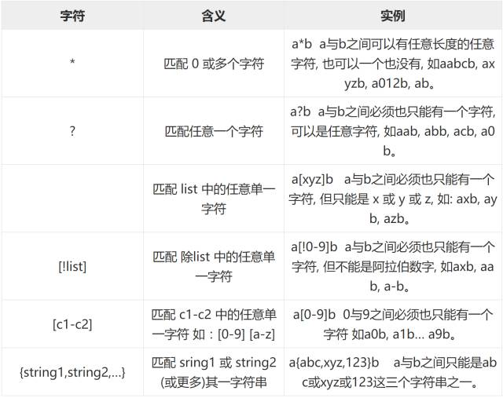
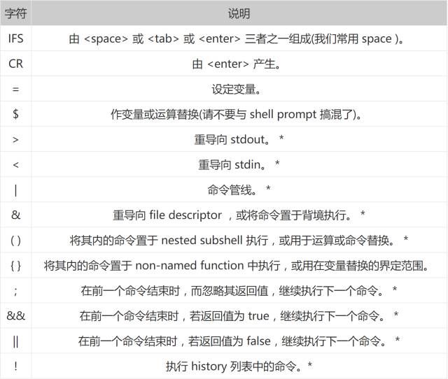
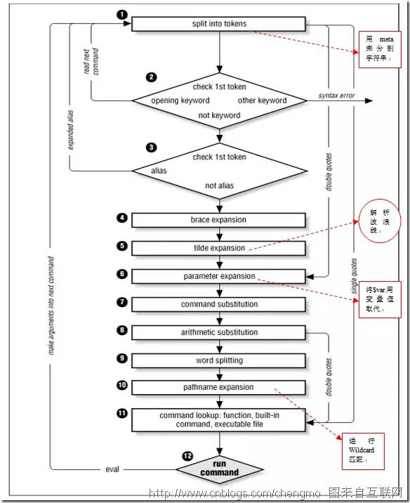

```
1.输出A B 不一致的数据
#!/bin/bash
A="aa bb cc dd ee"
B="AA bb CC dd ee"

AA=($A)
BB=($B)
for i in `seq 0 ${#AA[@]}`;do
  if [ ${AA[$i]} != ${BB[$i]} ];then
    X[$i]=${AA[$i]}
  fi
done
echo ${X[@]}

2.函数中输出函数名：$FUNCNAME
function log() {
    echo ${FUNCNAME[@]} #输出log action main
echo $FUNCNAME #输出log
}
function action() {
    log
}
action

3.循环中的跳转：continue [n] 

首先需要声明的是continue可用于子函数，跳转到父函数中的指定层次循环。如：
	就是跳转到x层
function son() {
    for z in 1 2 3; do
        if true; then
            echo $x,$y,$z
            continue 3
        fi
    done
}
function father() {
    for x in 1 2 3; do
        for y in 1 2 3; do
            son
        done
    done
}
father

n的值从1开始（不写默认为1，数字越大则层数越高，超过总循环层数时值为最大层数）；

以上代码中只有最上层"x"会正常循环完，其余子层都在首轮跳出，此时n的最大值为3,跳转到x；

若在son后加一个“&”使其在后台运行，此时continue能控制y、z两层，但不能跳转到x，即n的最大值为2。

不会的话，修改一下continue 3->continue 2,就知道怎么用了


4.变量间接引用（indirect expansion）
a=1
b=a
echo ${!b}
eval echo \$$b  输出都是1

像删除变量一样，删除函数也可以使用 unset 命令，不过要加上 .f 选项

5.进入目录并打包文件
cd /source/directory && tar cf -

6.猜数
#!/bin/sh
echo "Please input the num (1~~10): "
read num
while [[ $num != 4 ]]
do
if [ $num -lt 4 ]
then
 echo "Too small ,Try again.."
 read num
 elif [ $num -gt 4 ]
 then
 echo "Too big ,Try again.. "
 read num
 else
 exit 0
 fi
 done
echo "Yes ,you are right !!"

重点是exit 0的用法

7.使用tr命令将文件中的回车转换成空格：
[root@pps ~]# cat /etc/shells | tr "\n" " " > /tmp/tmp.file
 
将文件中内容给数组赋值：(碰到第一个回车符之前的内容)
[root@pps ~]# read -a SHELLS < /tmp/tmp.file
 
查看数组赋值情况：
[root@pps ~]# set | grep "SHELLS"
SHELLS=([0]="/bin/sh" [1]="/bin/bash" [2]="/sbin/nologin" [3]="/bin/tcsh" [4]="/bin/csh" [5]="/bin/ksh")

8.ssh自动登录
expect autolog.sh

#!/usr/bin/expect -f
set timeout 19
spawn ssh root@192.168.18.167
expect "password:"
send "657834\r"
expect "]*"
interact

9.shell 不回显输入
#!/bin/bash
stty -echo
read pass < /dev/tty
stty echo
echo --------------------------
echo $pass

10.打开自动跟踪功能
shell脚本中加入
set -x
set +x

11.
字符类(Character class)
[:alnum:] Alphanumeric characters.
[:alpha:] Alphabetic characters.
[:blank:] Space and TAB characters.
[:cntrl:] Control characters.
[:digit:] Numeric characters.
[:graph:] Characters that are both printable and visible. (A space is printable but not visible, whereas an ‘a’ is both.)
[:lower:] Lowercase alphabetic characters.
[:print:] Printable characters (characters that are not control characters).
[:punct:] Punctuation characters (characters that are not letters, digits, control characters, or space characters).
[:space:] Space characters (such as space, TAB, and formfeed, to name a few).
[:upper:] Uppercase alphabetic characters.
[:xdigit:] Characters that are hexadecimal digits.

12 shell 查询数据库
[]中加双引号就不会出现[: too many arguments 这个错误
mysql -uroot -p12345678 -h192.168.100.75 apm4mobile -e "SELECT * from app_info"
result=`echo -E "SELECT * from app_info WHERE appName=$appName " | mysql -uroot -p12345678 -h192.168.100.75 apm4mobile `
if [ "$result" ]
then
{
        echo create application successful!
}
else
{
        echo create application failed!
}
fi

13.
source ./my.script 当前shell中执行
. ./my.script 产生一个 sub-shell 来执行

(cmd1;cmd2;...;cmdN)#在一个子shell里执行一组命令 
{cmd1;cmd2;...;cmdN}# 在当前shell里执行一组命令 

A=1;echo $A;{ A=2; };echo $A 
1 
2 
A=1;echo $A;( A=2; );echo $A 
1 
1 

14.
trap -l

trap "echo 'Hello World' " HUP INT QUIT TSTP
遇到HUP INT QUIT TSTP信号时执行双引号中的命令

trap "" HUP INT QUIT TSTP 忽略信号
trap : HUP INT QUIT TSTP 恢复信号
 
HUP(1) 挂起，通常因终端掉线或用户退出而引发

INT(2) 中断，通常因按下Ctrl+C组合键而引发

QUIT(3) 退出，通常因按下Ctrl+组合键而引发

ABRT(6) 中止，通常因某些严重的执行错误而引发

ALRM(14) 报警，通常用来处理超时

TERM(15) 终止，通常在系统关机时发送

trap func EXIT 允许在脚本结束时调用函数。由于无论正常退出抑或异常退出，所注册的函数都能得以调用，在需要调用一个清理函数的场景下，我都是用它注册清理函数，而不是简单地在脚本结尾调用清理函数。

trap func ERR 允许在运行出错时调用函数。一个常用的技法是，使用全局变量ERROR存储错误信息，然后在注册的函数中根据存储的值完成对应的错误报告。把原本四分五裂的错误处理逻辑集中到一处，有时候会起奇效。不过要记住，程序异常退出时，既会调用EXIT注册的函数，也会调用ERR注册的函数。

trap "commands" DEBUG

在脚本执行时打印调试信息，比如打印将要执行的命令及参数列表

格式：trap "commands" RETURN

当从shell函数返回、或者使用source命令执行另一个脚本文件时，执行commands指定的命令。

15.
stty -a
输出信号列表

16.
shell选项设置
shopt -s cdspell 
-s：激活指定的shell行为选项； 
-u：关闭指定的shell行为选项。

17.
如果shell脚本要加入crontable运行
  1.里面的文件,命令都使用全路径
  2.最好在第一行加入source /etc/profile

18.
有时候windows下编辑的shell脚本在linux上执行会出现莫名的错误，转换一下格式即可
yum -y install dos2unix
dos2unix *.sh

19.
交互过程使用管道的方式，自动输入yes
[root@localhost ~]# yes | cp filename new/filename  
linux默认

20.
[root@localhost ~]# alias 
alias cp='cp -i'

\cp 取消alias

21.
source不是直接执行一个文件，而是从一个文本文件里面读命令行，然后执行这些命令
. test.sh 《=》source test.sh 
可以使用在shell调用shell

22.
DATE=$(date +%Y%m%d) 
获取明天的日期
date -d next-day +%Y%m%d
获取昨天的日期
date -d last-day +%Y%m%d
获取上个月的年和月
date -d last-month +%Y%m
获取下个月的年和月
date -d next-month +%Y%m
获取明年的年份
date -d next-year +%Y

23.
指定bash
/usr/bin/env bash
/bin/bash

24.
在函数里面，声明一个全局变量可能会污染到其他作用域（尤其在你根本没有注意到这一点的情况下）。所以，对于在函数内声明的变量，请务必记得加上 local 限定词。

25.
shell 的 key-value
+ declare -a ARY
+ declare -A MAP
+ MAP+=([a]=1 [b]=2)
+ ARY+=(a b c)
+ echo ' ${ARY[1]}  '
 ${ARY[1]}  
+ echo b
b
+ echo ' ${MAP[a]}  '
 ${MAP[a]}  
+ echo 1
1
+ echo ' "${ARY[@]}"  '
 "${ARY[@]}"  
+ echo a b c
a b c
+ echo ' "${MAP[@]}"  '
 "${MAP[@]}"  
+ echo 1 2
1 2
+ echo ' "${ARY[@]:0:1}"  '
 "${ARY[@]:0:1}"  
+ echo a
a
+ echo ' ${#ARY[@]}  '
 ${#ARY[@]}  
+ echo 3
3
+ echo ' "${!MAP[@]}"  '
 "${!MAP[@]}"  
+ echo a b
a b
+ ARY[4]=a
+ echo ' ${ARY[@]}  '
 ${ARY[@]}  
+ echo a b c a
a b c a
+ echo ' ${ARY[3]}  '
 ${ARY[3]}  
+ echo

26.
大小写变换
HI=HellO  
  
echo "$HI" # HellO  
echo ${HI^} # HellO  
echo ${HI^^} # HELLO  
echo ${HI,} # hellO  
echo ${HI,,} # hello  
echo ${HI~} # hellO  
echo ${HI~~} #hELLo

^大写，,小写， ~大小写切换
重复一次只修改首字母，重复两次则应用于所有字母。
不能混用

27.
查找并替换
/MATCH/VALUE 替换第一个匹配的内容。
//MATCH/VALUE 替换匹配的内容

echo ${FILENAME/home/office} # /office/spacewander/param.sh  
echo ${FILENAME//s/S} # /home/Spacewander/param.Sh  

28.
# expand to default variable  
echo ${NULL-"Not null"} # Not null  
echo ${NULL} #  
  
# set default variable  
echo ${NIL="Not nil"} # Not nil  
echo ${NIL} # Not nil  

echo ${TARGET?Not Found} # 当$TARGET不存在时，显示TARGET: Not Found，并结束程序。  

28.
命令	        标准输出	错误输出
>/dev/null 2>&1	丢弃	    丢弃
2>&1 >/dev/null	丢弃	    屏幕

29.
echo for{,,}
for for for

for i in {1..5}; do echo $i; done

END=5
for i in `seq 1 $END`; do echo $i; done
for i in `eval echo {1..$END}`; do echo $i; done
for ((i=0;i<$END;i++)) do echo $i; done

echo {a..z}
echo {1..100}
seq 1 100
echo {00..09}
echo {a,b,c}{1,2,3}

30.
declare -u var
var="foo bar"
转大写
declare -l var
var="FOO BAR"
转小写

31.
对变量迭代求值，二次求值
var="hello"
hello="world"
echo ${!var}

var=1
var2=var
echo $(($var2))

eval echo \$$var2

32.







33.
GNU utility 的默认行为和 POSIX 标准不兼容。为了解决这种不兼容情况，Linux 系统引入了环境变量’POSIXLY_CORRECT’。
设置方法：
export POSIXLY_CORRECT=TRUE
取消设置：
unset POSIXLY_CORRECT

设置用法：
export _POSIX2_VERSION=199209
取消设置：
unset _POSIX2_VERSION

‘199209’ 代表 POSIX 1003.2-1992

34.
cp 1.txt ljtest/
cd !$ <==> cd ljtest/

!cat 执行上一个带cat的命令

35. 数组做参数
#!/bin/bash

function showArr(){

    arr=$1

    for i in ${arr[*]}; do
        echo $i
    done

}

regions=("GZ" "SH" "BJ")

showArr "${regions[*]}"

36.
pwd;(cd /etc && ls -a);pwd

(cd /etc && ls -a)
执行完成回到当前目录
```


